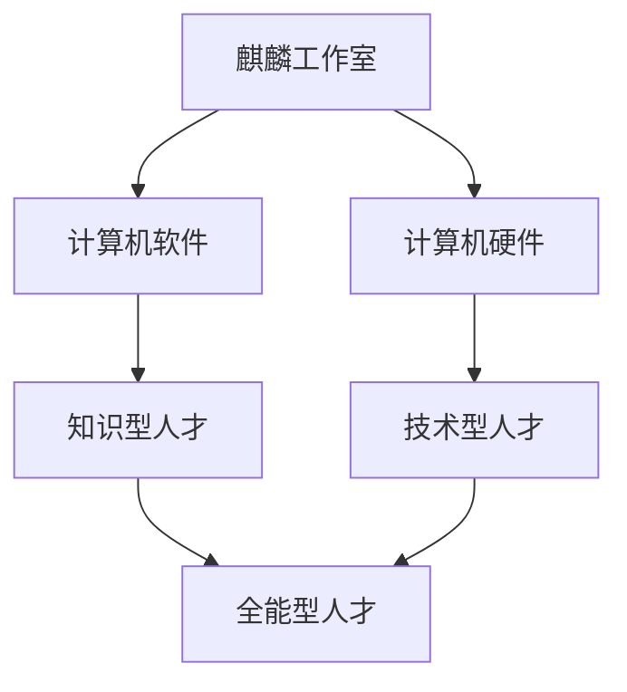

# Markdown入门练习
## 你好！
### 我是
#### 火麒麟-觉醒🔥
##### 很高兴
###### 认识你

---

**你好**，我*是*火麒麟-**觉醒🔥**，~~✧(◍˃̶ᗜ˂̶◍)✩~~  
**很高兴认识你！**_相处愉快_  
**欢迎加入**麒麟工作室(q群：1012978209)，与我们**共同交流！**

> 海内存知己，天涯若比邻
>> 别来无恙啊！

```
　　　　　[🍷]))
　　　　(( [🍸🍸]
　　　　[🍷🍷🍷]
 ∧__∧ [🍸🍸🍸🍸] ))
( ･ω･)[🍺🍺🍺🍺🍺]
/　　Ｏ━━━━━━━━━━━━
しーＪ
```
* 群主
    * 管理员
        * 群员
* 知识型人才
* 技术型人才

1. 🌟室长     火麒麟-觉醒🔥 
2. 🌟副室长   A7龙          
3. 🌟总顾问   九思属于三体  

$$f(x)=ax^2+bx_1+c+\Delta+\sqrt{2ab}$$

```python
print("Hello!")
```



|姓名|年龄|职业|
|:--------:|:-------:|:--------:|
|麒麟 |14  |学生|
|皮皮 |6   |修电脑的|
|龙   |13  |自由中|

这是我的github地址 [@火麒麟-觉醒🔥](https://github.com/Kirin7098)

---

**芙宁娜个人简介**  
芙宁娜，米哈游出品的游戏《原神》及其衍生作品中的角色，魔神名芙卡洛斯，“尘世七执政”中的末任水神，众水、众方、众民与众律法的女王，曾经统治着水之国枫丹，深受民众喜爱。


曾以水神之姿高居歌剧院，俯瞰众生相的芙宁娜，如今已经走下舞台，步入尘世。虽已不再“饰演神明”，但枫丹廷中仍有许多人奉她为偶像，而她热爱喧嚣的性格也一时难移。丰沛的情感，热闹的故事，仍如往常一样开演。只是从今往后，芙宁娜终于不必自高处遥望。尽管作为“神明”的一生已经谢幕，但她作为“人”的一生，或许才刚刚开始。

**关于麒麟工作室**  
麒麟工作室**Logo展示**


[加入我们](http://qm.qq.com/cgi-bin/qm/qr?_wv=1027&k=nTvOzDs1o3V-tjvw_bHtMjY_30ekiKzO&authKey=8zGD%2F2iIRsqDzGMf5fjUaGX3CLr%2Bm9WwkmunEXjl5N%2B9sBzWosRKpFICYfOeufb8&noverify=0&group_code=1012978209)

**主要**研究
- [x] Python
- [ ] `PHP`
- [x] C++
- [x] C#
- [x] C
- [x] Java
- [x] JavaScript
- [ ] `Go`

---
**语法总结**
```
Markdown是一种轻量级的标记语言
标题：使用 # 表示， # 越多标题级别越低，如 # 一级标题 、 ## 二级标题 。
无序列表： - 或 * 开头，如 - 列表项1 
有序列表：数字加 . 开头，如 1. 列表项1 。
加粗：用 ** 包裹文本，如 **加粗文本** 。
斜体：用 * 包裹文本，如 *斜体文本* 。
链接：格式为 [链接文本](链接地址) ，如 [百度](https://www.baidu.com) 。
图片：格式为  。![[]]
待办：- [ ]  - [x]
代码块：```
分隔线: ---
制表：|-|-|-|
数学公式：$公式$  $$公式居中$$

```

以上就是本次分享的全部内容，若有不足，请指正，谢谢！
